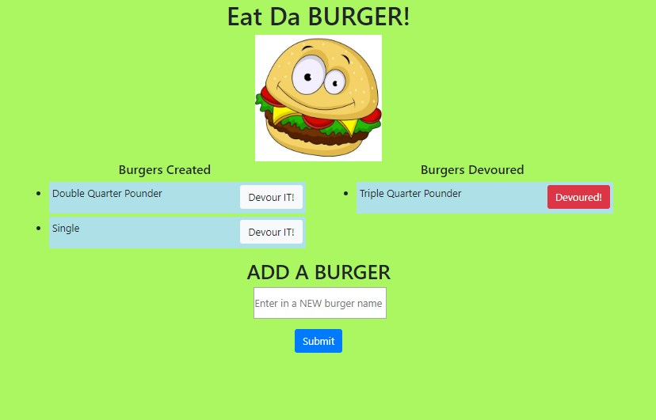

# Burger

<h1>Description</h1>

This application was developed in order to showcase newly devloped skills of MVC "Model-View-Controler". When the user adds a new burger to the application it will append to a MySQL database, then update when user "clicks" DEVOUR.
  
  
 click on the link! https://floating-fjord-46992.herokuapp.com/

  
  

